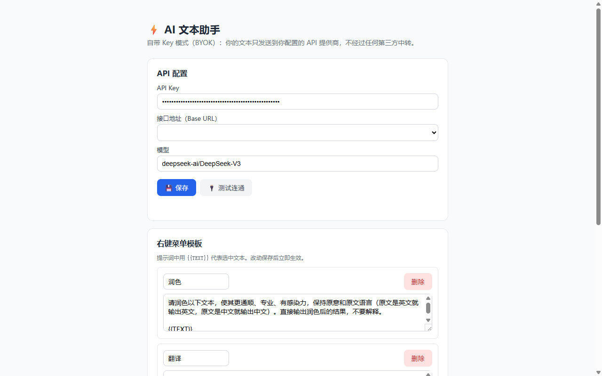
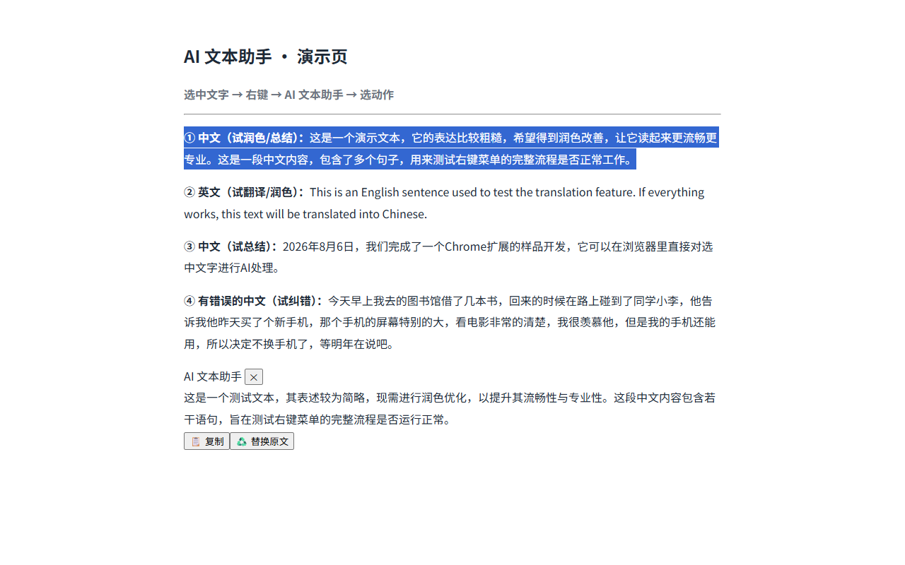
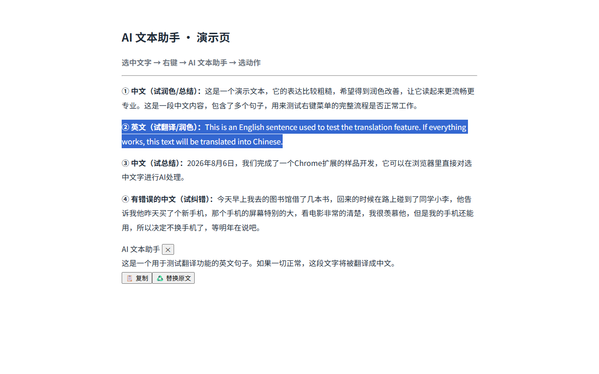
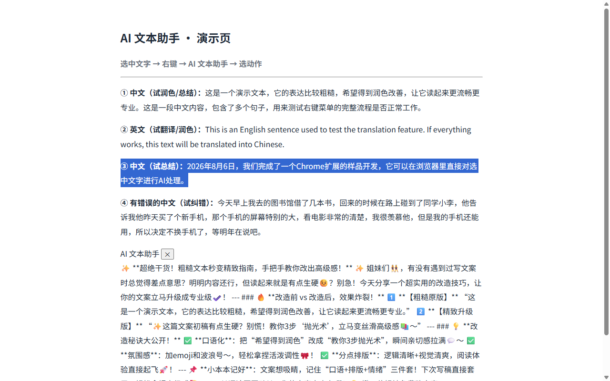
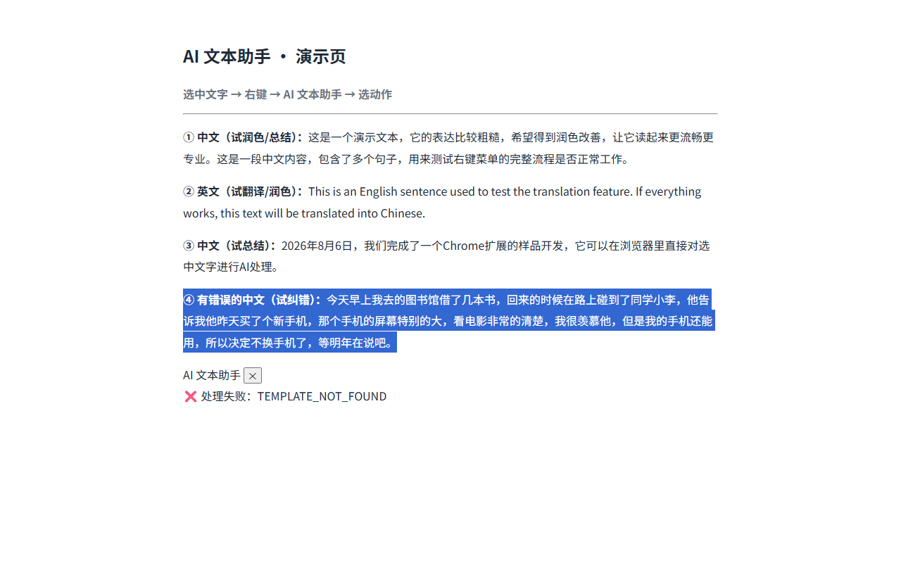

# AI 文本助手 · AI Text Assistant

> 选中网页任意文字 → 右键 → AI 润色 / 翻译 / 总结 / 纠错 / 自定义模板 → 浮窗结果 → 一键复制或替换原文。
> Select any text on a webpage → right-click → AI Polish / Translate / Summarize / Fix / Custom templates → floating result → copy or replace in one click.

浏览器里最快的 AI 文本处理右键菜单 · The fastest AI text processing right-click menu in your browser.

**BYOK · 零后端 · 最小权限 · 国内直连免代理**
**BYOK · Zero backend · Minimal permissions · No proxy needed in China (DeepSeek default)**

---

## 📸 功能演示 / Features

### 🎬 演示视频 / Demo video (26s)

<video controls width="100%" src="demos/demo.webm">
  <a href="demos/demo.webm">Download demo.webm</a>
</video>

| 设置页 / Options | 润色 / Polish | 翻译 / Translate |
|:---:|:---:|:---:|
|  |  |  |

| 自定义模板 / Custom template | 纠错 / Fix |
|:---:|:---:|
|  |  |

## ✨ 功能 / Features

- ✍️ **润色 Polish** — 更通顺、专业、有感染力（保持原文语言）
- 🌐 **翻译 Translate** — 中英互译，自动修正原文语法错误
- 📌 **总结 Summarize** — 快速提炼核心要点
- ✅ **纠错 Fix** — 修正错别字、语法、标点
- 🎨 **自定义模板 Custom templates** — 任意指令（如"改成小红书风格"），右键菜单动态生成

## 🚀 快速开始 / Quick Start

1. 下载本仓库，Chrome 打开 `chrome://extensions` → 开启「开发者模式」→「加载已解压的扩展程序」选择本目录
2. 点击工具栏图标打开设置页，填入你的 API Key（DeepSeek / OpenAI / SiliconFlow 或任意 OpenAI 兼容接口）
3. 选中网页文字 → 右键 → 「AI 文本助手」→ 选动作

```
Download the repo → chrome://extensions → Developer mode → Load unpacked → select this folder
Click the toolbar icon → enter your API key (any OpenAI-compatible endpoint)
Select text → right-click → AI Text Assistant → choose an action
```

## 🧱 技术架构 / Architecture

- **Manifest V3** + vanilla JS（无框架、无构建步骤）
- 权限：仅 `contextMenus` + `storage`（+ API 域名 host_permissions）——官方口径审核友好
- BYOK：Key 只存本地（`chrome.storage.local`），文本只发送到你配置的 API 提供商，**零中间商**
- 数据流：`content.js` 取选中文本 → `background.js` 调 OpenAI 兼容 API → 浮窗显示 → 复制/替换

```
manifest.json → MV3 声明
background.js → service worker：右键菜单 + API 调用 + 消息路由
content.js    → 页面注入：读选区、渲染 shadow DOM 浮窗、替换原文
options.html  → 设置页：Key / Base URL / 模型 / 自定义模板
icons/        → 16/32/48/128 几何风图标（tools/make_icons.py 可再生成）
```

## ✅ 测试 / Tests（38/38）

```bash
node test_smoke.cjs   # 17 —— 冒烟：菜单注册/存储/消息链路（playwright 加载扩展）
node test_edge.cjs    #  9 —— 边界：空选区/无 Key/API 错误/替换流程
node test_icons.cjs   #  4 —— 图标：尺寸/像素多样性
node test_e2e_real.cjs#  8 —— 真实 API 端到端（需 SILICONFLOW_API_KEY，含语义断言）
```

> e2e 语义断言（`/[\u4e00-\u9fff]/`）：翻译输出必须含中文、润色必须保持原文语言——防止"润色被翻成另一种语言"类回归。

## 🛡️ 发布前检查 / Pre-publish check

公开仓库 push 前必跑（蒸馏盲区 #39 固化：防密钥泄露，L-034/L-036 适用对象升级为公开仓库后强制）：

```bash
node tools/pre_publish_scan.cjs             # ① 敏感路径（.env/.pem/.key）② 真实密钥模式 ③ 未追踪敏感文件
node tools/pre_publish_scan.cjs --selftest  # 自测：15 项阳性/阴性对照（改脚本后必跑）
```

- 扫描通过（exit 0）才能 push；发现密钥（`sk-` 长串 / GitHub PAT / 私钥块 / `api_key=` 赋值等）→ 替换为占位符 → 重扫通过后再 push
- 限制说明：被 `.gitignore` 忽略的敏感文件不在扫描范围（其本不会被 push）；untracked 但文件名正常的新文件会做内容扫描（防硬编码 key 被误 add）
- 演示视频受回归保护（#40）：`node auto_demo.cjs` 的 4 动作全部带语义断言（润色保持中文 / 翻译输出中文 / 输出≠输入），任一失败则不更新 `demos/demo.webm` 并 exit 1

## 📋 路线图 / Roadmap

- [x] MVP（右键菜单 + 4 内置动作 + 自定义模板 + BYOK）
- [x] 上架材料齐备（`STORE_LISTING.md`：中英描述 / 隐私政策 / 截图）
- [ ] Chrome Web Store 上架（$5 注册费，待支付方式）
- [ ] 快捷键触发（Ctrl+Shift+K）
- [ ] 流式输出

## 📄 隐私 / Privacy

不收集、不上传、不存储任何用户数据。文本仅在触发处理时发送至**你自己配置的 API 提供商**。详见 `STORE_LISTING.md`。

## ⚖️ 许可 / License

MIT（待补充 © 2026）
